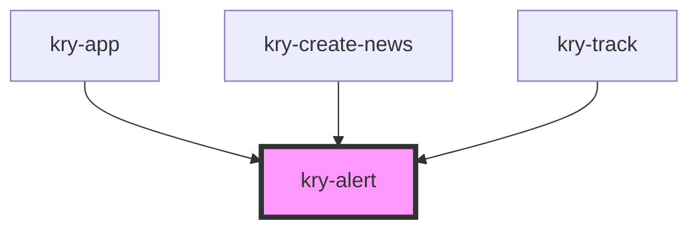

# bg-alert

<!-- Auto Generated Below -->

## Properties

| Property  | Attribute | Description | Type                                     | Default     |
| --------- | --------- | ----------- | ---------------------------------------- | ----------- |
| `block`   | `block`   |             | `boolean`                                | `undefined` |
| `color`   | `color`   |             | `"primary" \| "secondary" \| "tertiary"` | `'primary'` |
| `open`    | `open`    |             | `boolean`                                | `undefined` |
| `time`    | `time`    |             | `number`                                 | `1000`      |
| `variant` | `variant` |             | `"outline" \| "solid"`                   | `'solid'`   |

## Events

| Event      | Description | Type                   |
| ---------- | ----------- | ---------------------- |
| `kryClose` |             | `CustomEvent<boolean>` |

## Dependencies

### Used by

- [kry-app](../../workspaces/app)
- [kry-create-news](../../workspaces/create-news)
- [kry-track](../../workspaces/track)

### Graph

---

_Built with [StencilJS](https://stenciljs.com/)_
