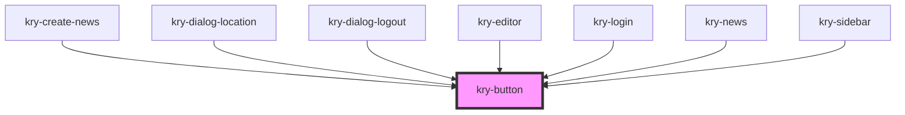

# bg-button

<!-- Auto Generated Below -->

## Properties

| Property  | Attribute | Description | Type                                                          | Default     |
| --------- | --------- | ----------- | ------------------------------------------------------------- | ----------- |
| `block`   | `block`   |             | `boolean`                                                     | `undefined` |
| `bold`    | `bold`    |             | `100 \| 200 \| 300 \| 400 \| 500 \| 600 \| 700 \| 800 \| 900` | `undefined` |
| `color`   | `color`   |             | `"primary" \| "secondary" \| "tertiary"`                      | `'primary'` |
| `disable` | `disable` |             | `boolean`                                                     | `undefined` |
| `light`   | `light`   |             | `"down" \| "up"`                                              | `'down'`    |
| `shape`   | `shape`   |             | `boolean`                                                     | `undefined` |
| `size`    | `size`    |             | `"large" \| "medium" \| "small"`                              | `'medium'`  |
| `type`    | `type`    |             | `"button" \| "submit"`                                        | `'button'`  |
| `variant` | `variant` |             | `"outline" \| "solid"`                                        | `'solid'`   |

## Dependencies

### Used by

- [kry-create-news](../../workspaces/create-news)
- [kry-dialog-location](../../composites/dialog-location)
- [kry-dialog-logout](../../composites/dialog-logout)
- [kry-editor](../editor)
- [kry-login](../../workspaces/login)
- [kry-news](../../workspaces/news)
- [kry-sidebar](../../composites/sidebar)

### Graph

---

_Built with [StencilJS](https://stenciljs.com/)_
