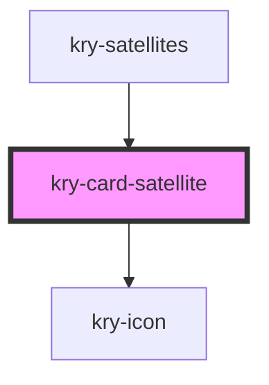

# kry-card-satellite

<!-- Auto Generated Below -->

## Properties

| Property       | Attribute      | Description | Type              | Default     |
| -------------- | -------------- | ----------- | ----------------- | ----------- |
| `azimuth`      | `azimuth`      |             | `number`          | `undefined` |
| `eclipsed`     | `eclipsed`     |             | `boolean`         | `undefined` |
| `favorite`     | `favorite`     |             | `boolean`         | `undefined` |
| `language`     | `language`     |             | `"en" \| "pt-BR"` | `undefined` |
| `satlatitude`  | `satlatitude`  |             | `number`          | `undefined` |
| `satlongitude` | `satlongitude` |             | `number`          | `undefined` |
| `satname`      | `satname`      |             | `string`          | `undefined` |
| `timestamp`    | `timestamp`    |             | `string`          | `undefined` |

## Events

| Event                  | Description | Type                   |
| ---------------------- | ----------- | ---------------------- |
| `kryFavoriteSatellite` |             | `CustomEvent<boolean>` |
| `kryTrackSatellite`    |             | `CustomEvent<boolean>` |

## Dependencies

### Used by

- [kry-satellites](../../workspaces/satellites)

### Depends on

- [kry-icon](../icon)

### Graph

---

_Built with [StencilJS](https://stenciljs.com/)_
