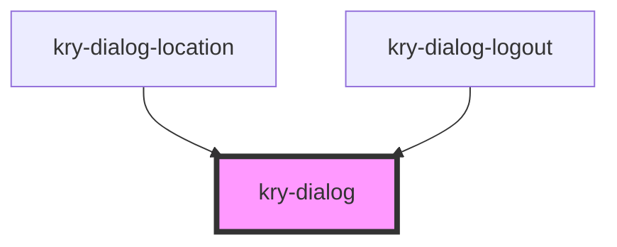

# kry-dialog

<!-- Auto Generated Below -->

## Properties

| Property | Attribute | Description | Type      | Default     |
| -------- | --------- | ----------- | --------- | ----------- |
| `fixed`  | `fixed`   |             | `boolean` | `true`      |
| `open`   | `open`    |             | `boolean` | `undefined` |

## Events

| Event      | Description | Type                   |
| ---------- | ----------- | ---------------------- |
| `kryClose` |             | `CustomEvent<boolean>` |

## Dependencies

### Used by

- [kry-dialog-location](../../composites/dialog-location)
- [kry-dialog-logout](../../composites/dialog-logout)

### Graph

---

_Built with [StencilJS](https://stenciljs.com/)_
