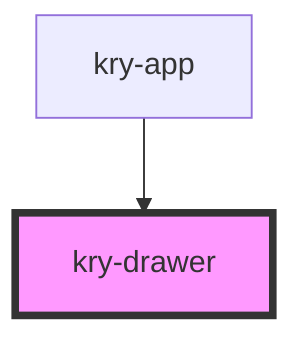

# kry-drawer

<!-- Auto Generated Below -->

## Properties

| Property     | Attribute     | Description | Type                                     | Default     |
| ------------ | ------------- | ----------- | ---------------------------------------- | ----------- |
| `anchor`     | `anchor`      |             | `"bottom" \| "left" \| "right" \| "top"` | `'right'`   |
| `blurShadow` | `blur-shadow` |             | `boolean`                                | `undefined` |
| `color`      | `color`       |             | `string`                                 | `undefined` |
| `open`       | `open`        |             | `boolean`                                | `undefined` |
| `shadow`     | `shadow`      |             | `boolean`                                | `true`      |
| `zIndex`     | `z-index`     |             | `number`                                 | `10`        |

## Events

| Event      | Description | Type                   |
| ---------- | ----------- | ---------------------- |
| `kryClose` |             | `CustomEvent<boolean>` |

## Dependencies

### Used by

- [kry-app](../../workspaces/app)

### Graph

---

_Built with [StencilJS](https://stenciljs.com/)_
