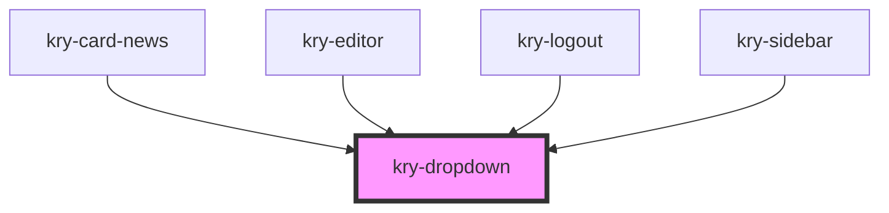

# kry-dropdown

<!-- Auto Generated Below -->

## Properties

| Property   | Attribute  | Description | Type      | Default     |
| ---------- | ---------- | ----------- | --------- | ----------- |
| `dropdown` | `dropdown` |             | `string`  | `undefined` |
| `left`     | `left`     |             | `number`  | `0`         |
| `open`     | `open`     |             | `boolean` | `undefined` |
| `top`      | `top`      |             | `number`  | `0`         |

## Events

| Event      | Description | Type                   |
| ---------- | ----------- | ---------------------- |
| `kryClose` |             | `CustomEvent<boolean>` |

## Dependencies

### Used by

- [kry-card-news](../card-news)
- [kry-editor](../editor)
- [kry-logout](../../composites/logout)
- [kry-sidebar](../../composites/sidebar)

### Graph

---

_Built with [StencilJS](https://stenciljs.com/)_
