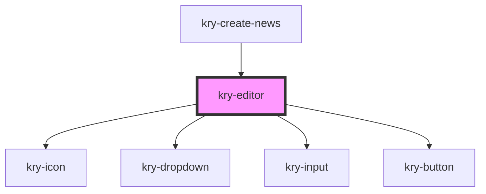

# kry-editor

<!-- Auto Generated Below -->

## Properties

| Property  | Attribute | Description | Type      | Default     |
| --------- | --------- | ----------- | --------- | ----------- |
| `invalid` | `invalid` |             | `boolean` | `undefined` |
| `message` | `message` |             | `string`  | `undefined` |
| `value`   | `value`   |             | `string`  | `undefined` |

## Events

| Event       | Description | Type                  |
| ----------- | ----------- | --------------------- |
| `kryChange` |             | `CustomEvent<string>` |

## Dependencies

### Used by

- [kry-create-news](../../workspaces/create-news)

### Depends on

- [kry-icon](../icon)
- [kry-dropdown](../dropdown)
- [kry-input](../input)
- [kry-button](../button)

### Graph

---

_Built with [StencilJS](https://stenciljs.com/)_
