# kry-icon

<!-- Auto Generated Below -->

## Properties

| Property | Attribute | Description | Type     | Default     |
| -------- | --------- | ----------- | -------- | ----------- |
| `name`   | `name`    |             | `string` | `undefined` |

## Events

| Event      | Description | Type                   |
| ---------- | ----------- | ---------------------- |
| `kryClick` |             | `CustomEvent<boolean>` |

## Dependencies

### Used by

- [kry-card-news](../card-news)
- [kry-card-satellite](../card-satellite)
- [kry-create-news](../../workspaces/create-news)
- [kry-dialog-location](../../composites/dialog-location)
- [kry-dialog-logout](../../composites/dialog-logout)
- [kry-dropdown-item](../dropdown-item)
- [kry-editor](../editor)
- [kry-logout](../../composites/logout)
- [kry-map](../map)
- [kry-navbar](../navbar)
- [kry-news](../../workspaces/news)
- [kry-satellites](../../workspaces/satellites)
- [kry-search](../search)
- [kry-select](../select)
- [kry-sidebar](../../composites/sidebar)
- [kry-sidebar-item](../sidebar-item)
- [kry-track](../../workspaces/track)
- [kry-view-news](../../workspaces/view-news)

### Graph

```mermaid
graph TD;
  kry-card-news --> kry-icon
  kry-card-satellite --> kry-icon
  kry-create-news --> kry-icon
  kry-dialog-location --> kry-icon
  kry-dialog-logout --> kry-icon
  kry-dropdown-item --> kry-icon
  kry-editor --> kry-icon
  kry-logout --> kry-icon
  kry-map --> kry-icon
  kry-navbar --> kry-icon
  kry-news --> kry-icon
  kry-satellites --> kry-icon
  kry-search --> kry-icon
  kry-select --> kry-icon
  kry-sidebar --> kry-icon
  kry-sidebar-item --> kry-icon
  kry-track --> kry-icon
  kry-view-news --> kry-icon
  style kry-icon fill:#f9f,stroke:#333,stroke-width:4px
```

---

_Built with [StencilJS](https://stenciljs.com/)_
