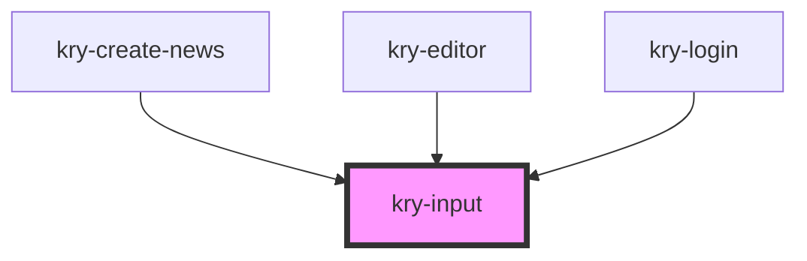

# kry-input

<!-- Auto Generated Below -->

## Properties

| Property      | Attribute     | Description | Type                                     | Default     |
| ------------- | ------------- | ----------- | ---------------------------------------- | ----------- |
| `color`       | `color`       |             | `"primary" \| "secondary" \| "tertiary"` | `'primary'` |
| `height`      | `height`      |             | `number`                                 | `undefined` |
| `invalid`     | `invalid`     |             | `boolean`                                | `undefined` |
| `label`       | `label`       |             | `string`                                 | `undefined` |
| `message`     | `message`     |             | `string`                                 | `undefined` |
| `placeholder` | `placeholder` |             | `string`                                 | `undefined` |
| `resize`      | `resize`      |             | `boolean`                                | `undefined` |
| `type`        | `type`        |             | `"password" \| "text"`                   | `'text'`    |
| `value`       | `value`       |             | `string`                                 | `undefined` |

## Events

| Event            | Description | Type                  |
| ---------------- | ----------- | --------------------- |
| `kryChangeValue` |             | `CustomEvent<string>` |

## Dependencies

### Used by

- [kry-create-news](../../workspaces/create-news)
- [kry-editor](../editor)
- [kry-login](../../workspaces/login)

### Graph

---

_Built with [StencilJS](https://stenciljs.com/)_
