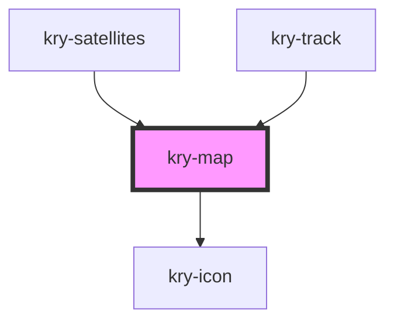

# kry-map

<!-- Auto Generated Below -->

## Properties

| Property     | Attribute     | Description | Type            | Default                           |
| ------------ | ------------- | ----------- | --------------- | --------------------------------- |
| `altitude`   | `altitude`    |             | `number`        | `undefined`                       |
| `controls`   | `controls`    |             | `boolean`       | `true`                            |
| `homeIcon`   | `home-icon`   |             | `string`        | `'ri-map-pin-user-fill'`          |
| `labelHome`  | `label-home`  |             | `string`        | `''`                              |
| `latitude`   | `latitude`    |             | `number`        | `undefined`                       |
| `layer`      | `layer`       |             | `string`        | `layers.dark`                     |
| `lines`      | --            |             | `KryMapPoint[]` | `[]`                              |
| `longitude`  | `longitude`   |             | `number`        | `undefined`                       |
| `markHome`   | `mark-home`   |             | `boolean`       | `undefined`                       |
| `maxZoom`    | `max-zoom`    |             | `number`        | `8`                               |
| `minZoom`    | `min-zoom`    |             | `number`        | `1`                               |
| `points`     | --            |             | `KryMapPoint[]` | `[]`                              |
| `trace`      | `trace`       |             | `boolean`       | `undefined`                       |
| `track`      | `track`       |             | `boolean`       | `undefined`                       |
| `unknowIcon` | `unknow-icon` |             | `string`        | `'ri-checkbox-blank-circle-fill'` |
| `zoom`       | `zoom`        |             | `number`        | `3`                               |

## Events

| Event             | Description | Type                  |
| ----------------- | ----------- | --------------------- |
| `kryClickMarkMap` |             | `CustomEvent<number>` |

## Methods

### `onFly(latlang: [number, number], zoom?: number, options?: ZoomPanOptions) => Promise<void>`

#### Returns

Type: `Promise<void>`

### `resizeMap() => Promise<void>`

#### Returns

Type: `Promise<void>`

## Dependencies

### Used by

- [kry-satellites](../../workspaces/satellites)
- [kry-track](../../workspaces/track)

### Depends on

- [kry-icon](../icon)

### Graph

---

_Built with [StencilJS](https://stenciljs.com/)_
