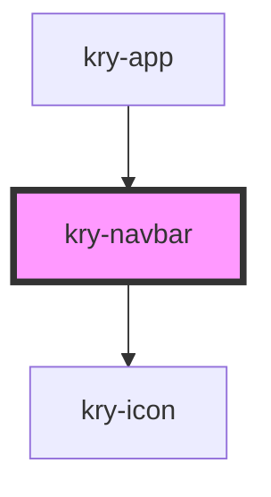

# kry-navbar

<!-- Auto Generated Below -->

## Properties

| Property | Attribute | Description | Type     | Default     |
| -------- | --------- | ----------- | -------- | ----------- |
| `logo`   | `logo`    |             | `string` | `undefined` |

## Events

| Event           | Description | Type                   |
| --------------- | ----------- | ---------------------- |
| `kryOpenDrawer` |             | `CustomEvent<boolean>` |
| `kryRedirect`   |             | `CustomEvent<string>`  |

## Dependencies

### Used by

- [kry-app](../../workspaces/app)

### Depends on

- [kry-icon](../icon)

### Graph

---

_Built with [StencilJS](https://stenciljs.com/)_
