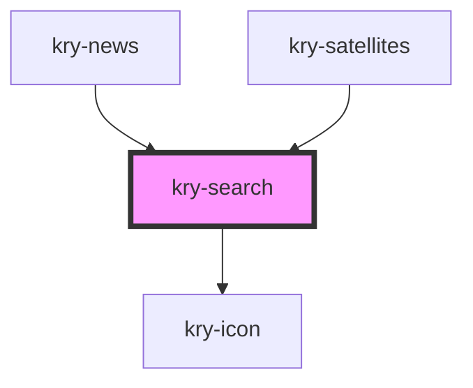

# kry-search

<!-- Auto Generated Below -->

## Properties

| Property      | Attribute     | Description | Type                                     | Default            |
| ------------- | ------------- | ----------- | ---------------------------------------- | ------------------ |
| `color`       | `color`       |             | `"primary" \| "secondary" \| "tertiary"` | `'primary'`        |
| `icon`        | `icon`        |             | `string`                                 | `'ri-search-line'` |
| `invalid`     | `invalid`     |             | `boolean`                                | `undefined`        |
| `label`       | `label`       |             | `string`                                 | `undefined`        |
| `loading`     | `loading`     |             | `boolean`                                | `undefined`        |
| `message`     | `message`     |             | `string`                                 | `undefined`        |
| `placeholder` | `placeholder` |             | `string`                                 | `undefined`        |
| `type`        | `type`        |             | `"password" \| "text"`                   | `'text'`           |
| `value`       | `value`       |             | `string`                                 | `undefined`        |

## Events

| Event            | Description | Type                   |
| ---------------- | ----------- | ---------------------- |
| `kryChangeValue` |             | `CustomEvent<string>`  |
| `krySearch`      |             | `CustomEvent<boolean>` |

## Dependencies

### Used by

- [kry-news](../../workspaces/news)
- [kry-satellites](../../workspaces/satellites)

### Depends on

- [kry-icon](../icon)

### Graph

---

_Built with [StencilJS](https://stenciljs.com/)_
