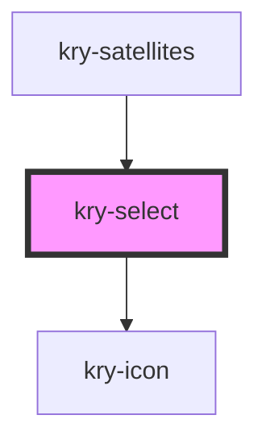

# kry-select

<!-- Auto Generated Below -->

## Properties

| Property      | Attribute     | Description | Type                                             | Default     |
| ------------- | ------------- | ----------- | ------------------------------------------------ | ----------- |
| `label`       | `label`       |             | `string`                                         | `undefined` |
| `open`        | `open`        |             | `boolean`                                        | `undefined` |
| `options`     | --            |             | `SelectValue[]`                                  | `[]`        |
| `placeholder` | `placeholder` |             | `string`                                         | `''`        |
| `value`       | --            |             | `{ title: string; key: string; icon?: string; }` | `undefined` |

## Events

| Event       | Description | Type                  |
| ----------- | ----------- | --------------------- |
| `kryChange` |             | `CustomEvent<string>` |

## Dependencies

### Used by

- [kry-satellites](../../workspaces/satellites)

### Depends on

- [kry-icon](../icon)

### Graph

---

_Built with [StencilJS](https://stenciljs.com/)_
