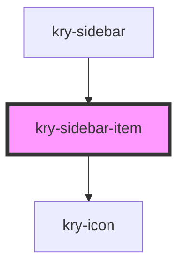

# kry-sidebar-item

<!-- Auto Generated Below -->

## Properties

| Property | Attribute | Description | Type      | Default     |
| -------- | --------- | ----------- | --------- | ----------- |
| `active` | `active`  |             | `boolean` | `undefined` |
| `icon`   | `icon`    |             | `string`  | `undefined` |
| `name`   | `name`    |             | `string`  | `undefined` |
| `route`  | `route`   |             | `string`  | `undefined` |

## Dependencies

### Used by

- [kry-sidebar](../../composites/sidebar)

### Depends on

- [kry-icon](../icon)

### Graph

---

_Built with [StencilJS](https://stenciljs.com/)_
