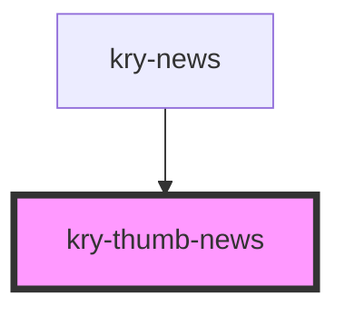

# kry-thumb-news

<!-- Auto Generated Below -->

## Properties

| Property      | Attribute     | Description | Type     | Default     |
| ------------- | ------------- | ----------- | -------- | ----------- |
| `description` | `description` |             | `string` | `undefined` |
| `image`       | `image`       |             | `string` | `undefined` |
| `name`        | `name`        |             | `string` | `undefined` |

## Events

| Event         | Description | Type                   |
| ------------- | ----------- | ---------------------- |
| `kryRedirect` |             | `CustomEvent<boolean>` |

## Dependencies

### Used by

- [kry-news](../../workspaces/news)

### Graph

---

_Built with [StencilJS](https://stenciljs.com/)_
