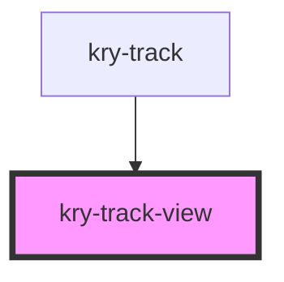

# kry-track-view

<!-- Auto Generated Below -->

## Properties

| Property      | Attribute     | Description | Type              | Default     |
| ------------- | ------------- | ----------- | ----------------- | ----------- |
| `azimuth`     | `azimuth`     |             | `number`          | `undefined` |
| `dec`         | `dec`         |             | `number`          | `undefined` |
| `eclipsed`    | `eclipsed`    |             | `boolean`         | `undefined` |
| `elevation`   | `elevation`   |             | `number`          | `undefined` |
| `language`    | `language`    |             | `"en" \| "pt-BR"` | `undefined` |
| `latitude`    | `latitude`    |             | `number`          | `undefined` |
| `longitude`   | `longitude`   |             | `number`          | `undefined` |
| `ra`          | `ra`          |             | `number`          | `undefined` |
| `sataltitude` | `sataltitude` |             | `number`          | `undefined` |
| `timestamp`   | `timestamp`   |             | `string`          | `undefined` |

## Dependencies

### Used by

- [kry-track](../../workspaces/track)

### Graph

---

_Built with [StencilJS](https://stenciljs.com/)_
