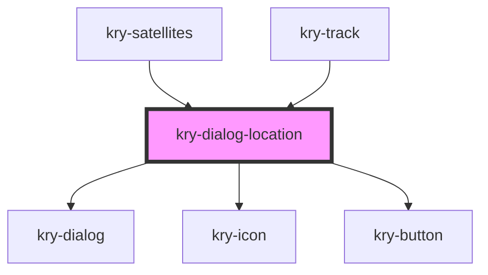

# kry-dialog-logout

<!-- Auto Generated Below -->

## Properties

| Property | Attribute | Description | Type      | Default     |
| -------- | --------- | ----------- | --------- | ----------- |
| `open`   | `open`    |             | `boolean` | `undefined` |

## Events

| Event                | Description | Type                   |
| -------------------- | ----------- | ---------------------- |
| `kryClose`           |             | `CustomEvent<boolean>` |
| `kryRedirect`        |             | `CustomEvent<string>`  |
| `kryRequestLocation` |             | `CustomEvent<boolean>` |

## Dependencies

### Used by

- [kry-satellites](../../workspaces/satellites)
- [kry-track](../../workspaces/track)

### Depends on

- [kry-dialog](../../components/dialog)
- [kry-icon](../../components/icon)
- [kry-button](../../components/button)

### Graph

---

_Built with [StencilJS](https://stenciljs.com/)_
