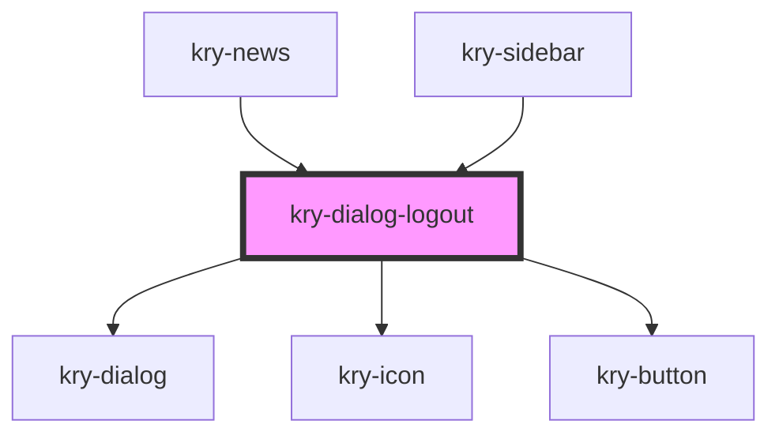

# kry-dialog-logout

<!-- Auto Generated Below -->

## Properties

| Property | Attribute | Description | Type      | Default                            |
| -------- | --------- | ----------- | --------- | ---------------------------------- |
| `icon`   | `icon`    |             | `string`  | `'ri-logout-circle-r-fill'`        |
| `name`   | `name`    |             | `string`  | `'Do you really want to log out?'` |
| `open`   | `open`    |             | `boolean` | `undefined`                        |

## Events

| Event        | Description | Type                   |
| ------------ | ----------- | ---------------------- |
| `kryClose`   |             | `CustomEvent<boolean>` |
| `kryConfirm` |             | `CustomEvent<boolean>` |

## Dependencies

### Used by

- [kry-news](../../workspaces/news)
- [kry-sidebar](../sidebar)

### Depends on

- [kry-dialog](../../components/dialog)
- [kry-icon](../../components/icon)
- [kry-button](../../components/button)

### Graph

---

_Built with [StencilJS](https://stenciljs.com/)_
