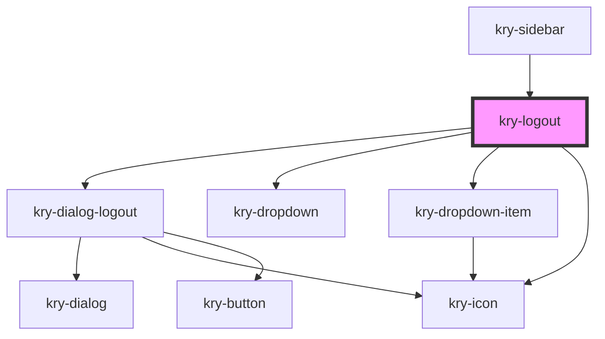

# kry-logout

<!-- Auto Generated Below -->

## Properties

| Property   | Attribute  | Description | Type              | Default     |
| ---------- | ---------- | ----------- | ----------------- | ----------- |
| `avatar`   | `avatar`   |             | `string`          | `undefined` |
| `email`    | `email`    |             | `string`          | `undefined` |
| `language` | `language` |             | `"en" \| "pt-BR"` | `undefined` |
| `username` | `username` |             | `string`          | `undefined` |

## Events

| Event            | Description | Type                   |
| ---------------- | ----------- | ---------------------- |
| `kryCloseDrawer` |             | `CustomEvent<boolean>` |
| `kryLogoutApp`   |             | `CustomEvent<boolean>` |
| `kryRedirect`    |             | `CustomEvent<string>`  |

## Dependencies

### Used by

- [kry-sidebar](../sidebar)

### Depends on

- [kry-dialog-logout](../dialog-logout)
- [kry-dropdown](../../components/dropdown)
- [kry-dropdown-item](../../components/dropdown-item)
- [kry-icon](../../components/icon)

### Graph

---

_Built with [StencilJS](https://stenciljs.com/)_
