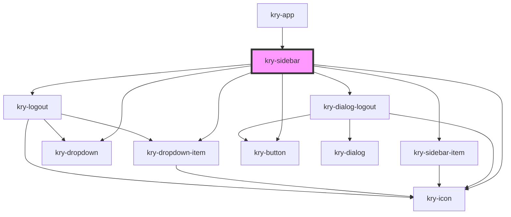

# kry-sidebar

<!-- Auto Generated Below -->

## Properties

| Property      | Attribute      | Description | Type                                                                                                                                                                                           | Default     |
| ------------- | -------------- | ----------- | ---------------------------------------------------------------------------------------------------------------------------------------------------------------------------------------------- | ----------- |
| `background`  | `background`   |             | `string`                                                                                                                                                                                       | `undefined` |
| `currentItem` | `current-item` |             | `number`                                                                                                                                                                                       | `undefined` |
| `items`       | --             |             | `MenuItem[]`                                                                                                                                                                                   | `[]`        |
| `language`    | `language`     |             | `"en" \| "pt-BR"`                                                                                                                                                                              | `undefined` |
| `logged`      | `logged`       |             | `boolean`                                                                                                                                                                                      | `undefined` |
| `logo`        | `logo`         |             | `string`                                                                                                                                                                                       | `undefined` |
| `open`        | `open`         |             | `boolean`                                                                                                                                                                                      | `undefined` |
| `user`        | --             |             | `{ id?: string; email?: string; avatar?: string; created_at?: string; updated_at?: string; deleted_at?: string; satellites?: number[]; thumb?: string; roles?: string[]; username?: string; }` | `undefined` |

## Events

| Event            | Description | Type                   |
| ---------------- | ----------- | ---------------------- |
| `kryCloseDrawer` |             | `CustomEvent<boolean>` |
| `kryLogoutApp`   |             | `CustomEvent<boolean>` |
| `kryRedirect`    |             | `CustomEvent<string>`  |

## Dependencies

### Used by

- [kry-app](../../workspaces/app)

### Depends on

- [kry-dialog-logout](../dialog-logout)
- [kry-icon](../../components/icon)
- [kry-sidebar-item](../../components/sidebar-item)
- [kry-dropdown](../../components/dropdown)
- [kry-dropdown-item](../../components/dropdown-item)
- [kry-logout](../logout)
- [kry-button](../../components/button)

### Graph

---

_Built with [StencilJS](https://stenciljs.com/)_
