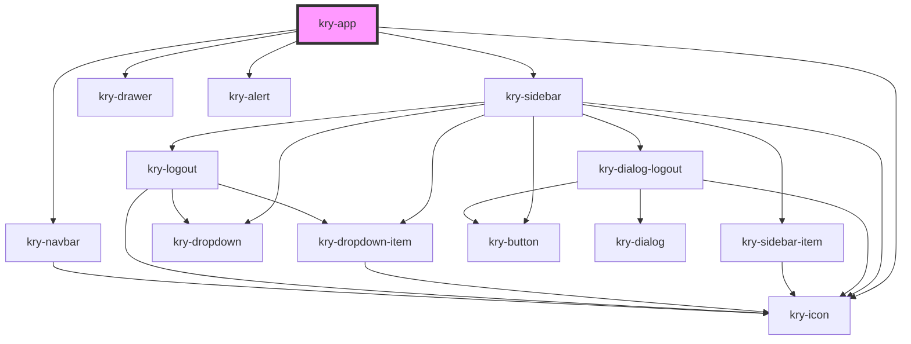

# kry-app

<!-- Auto Generated Below -->

## Properties

| Property      | Attribute    | Description | Type                                                                                                                                                                                           | Default     |
| ------------- | ------------ | ----------- | ---------------------------------------------------------------------------------------------------------------------------------------------------------------------------------------------- | ----------- |
| `alert`       | --           |             | `{ color: KryColor; open: boolean; title?: string; }`                                                                                                                                          | `undefined` |
| `background`  | `background` |             | `string`                                                                                                                                                                                       | `undefined` |
| `hide`        | `hide`       |             | `boolean`                                                                                                                                                                                      | `undefined` |
| `items`       | --           |             | `any[]`                                                                                                                                                                                        | `[]`        |
| `language`    | `language`   |             | `"en" \| "pt-BR"`                                                                                                                                                                              | `'en'`      |
| `logged`      | `logged`     |             | `boolean`                                                                                                                                                                                      | `undefined` |
| `pathname`    | `pathname`   |             | `string`                                                                                                                                                                                       | `undefined` |
| `uniquePages` | --           |             | `string[]`                                                                                                                                                                                     | `[]`        |
| `user`        | --           |             | `{ id?: string; email?: string; avatar?: string; created_at?: string; updated_at?: string; deleted_at?: string; satellites?: number[]; thumb?: string; roles?: string[]; username?: string; }` | `undefined` |

## Events

| Event          | Description | Type                                                               |
| -------------- | ----------- | ------------------------------------------------------------------ |
| `kryAlert`     |             | `CustomEvent<{ color: KryColor; open: boolean; title?: string; }>` |
| `kryLogoutApp` |             | `CustomEvent<boolean>`                                             |
| `kryRedirect`  |             | `CustomEvent<string>`                                              |

## Dependencies

### Depends on

- [kry-sidebar](../../composites/sidebar)
- [kry-icon](../../components/icon)
- [kry-drawer](../../components/drawer)
- [kry-navbar](../../components/navbar)
- [kry-alert](../../components/alert)

### Graph

---

_Built with [StencilJS](https://stenciljs.com/)_
