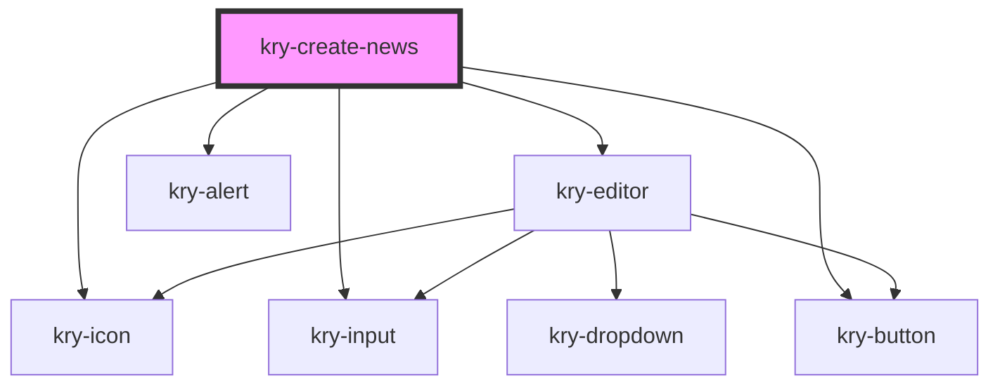

# kry-create-news

<!-- Auto Generated Below -->

## Properties

| Property             | Attribute             | Description | Type                                                  | Default     |
| -------------------- | --------------------- | ----------- | ----------------------------------------------------- | ----------- |
| `alert`              | --                    |             | `{ color: KryColor; open: boolean; title?: string; }` | `undefined` |
| `content`            | `content`             |             | `string`                                              | `undefined` |
| `contentMessage`     | `content-message`     |             | `string`                                              | `undefined` |
| `description`        | `description`         |             | `string`                                              | `undefined` |
| `descriptionMessage` | `description-message` |             | `string`                                              | `undefined` |
| `edit`               | `edit`                |             | `boolean`                                             | `undefined` |
| `font`               | `font`                |             | `string`                                              | `undefined` |
| `fontMessage`        | `font-message`        |             | `string`                                              | `undefined` |
| `image`              | `image`               |             | `string`                                              | `undefined` |
| `imageMessage`       | `image-message`       |             | `string`                                              | `undefined` |
| `isLoading`          | `is-loading`          |             | `boolean`                                             | `undefined` |
| `isValid`            | `is-valid`            |             | `boolean`                                             | `undefined` |
| `name`               | `name`                |             | `string`                                              | `undefined` |
| `nameMessage`        | `name-message`        |             | `string`                                              | `undefined` |

## Events

| Event                  | Description | Type                                                               |
| ---------------------- | ----------- | ------------------------------------------------------------------ |
| `kryAlertChange`       |             | `CustomEvent<{ color: KryColor; open: boolean; title?: string; }>` |
| `kryChangeContent`     |             | `CustomEvent<string>`                                              |
| `kryChangeDescription` |             | `CustomEvent<string>`                                              |
| `kryChangeFont`        |             | `CustomEvent<string>`                                              |
| `kryChangeImage`       |             | `CustomEvent<string>`                                              |
| `kryChangeName`        |             | `CustomEvent<string>`                                              |
| `kryFallback`          |             | `CustomEvent<boolean>`                                             |
| `krySubmit`            |             | `CustomEvent<boolean>`                                             |

## Dependencies

### Depends on

- [kry-icon](../../components/icon)
- [kry-input](../../components/input)
- [kry-editor](../../components/editor)
- [kry-button](../../components/button)
- [kry-alert](../../components/alert)

### Graph

---

_Built with [StencilJS](https://stenciljs.com/)_
