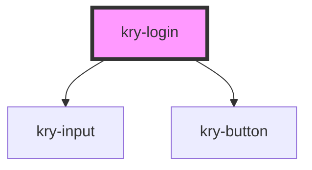

# kry-login

<!-- Auto Generated Below -->

## Properties

| Property          | Attribute          | Description | Type                  | Default      |
| ----------------- | ------------------ | ----------- | --------------------- | ------------ |
| `action`          | `action`           |             | `string`              | `undefined`  |
| `background`      | `background`       |             | `string`              | `undefined`  |
| `email`           | `email`            |             | `string`              | `undefined`  |
| `emailMessage`    | `email-message`    |             | `string`              | `undefined`  |
| `footer`          | `footer`           |             | `string`              | `undefined`  |
| `icon`            | `icon`             |             | `string`              | `undefined`  |
| `isInvalid`       | `is-invalid`       |             | `boolean`             | `undefined`  |
| `isLoading`       | `is-loading`       |             | `boolean`             | `undefined`  |
| `labelEmail`      | `label-email`      |             | `string`              | `'Email'`    |
| `labelPassword`   | `label-password`   |             | `string`              | `'Password'` |
| `labelUsername`   | `label-username`   |             | `string`              | `'Username'` |
| `password`        | `password`         |             | `string`              | `undefined`  |
| `passwordMessage` | `password-message` |             | `string`              | `undefined`  |
| `redirect`        | `redirect`         |             | `string`              | `undefined`  |
| `type`            | `type`             |             | `"login" \| "signup"` | `'login'`    |
| `username`        | `username`         |             | `string`              | `undefined`  |
| `usernameMessage` | `username-message` |             | `string`              | `undefined`  |

## Events

| Event               | Description | Type                   |
| ------------------- | ----------- | ---------------------- |
| `kryAuth`           |             | `CustomEvent<boolean>` |
| `kryChangeEmail`    |             | `CustomEvent<any>`     |
| `kryChangePassword` |             | `CustomEvent<any>`     |
| `kryChangeUsername` |             | `CustomEvent<any>`     |
| `kryRedirect`       |             | `CustomEvent<string>`  |

## Dependencies

### Depends on

- [kry-input](../../components/input)
- [kry-button](../../components/button)

### Graph

---

_Built with [StencilJS](https://stenciljs.com/)_
