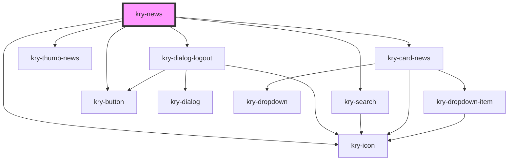

# kry-news

<!-- Auto Generated Below -->

## Properties

| Property   | Attribute   | Description | Type      | Default     |
| ---------- | ----------- | ----------- | --------- | ----------- |
| `admin`    | `admin`     |             | `boolean` | `undefined` |
| `isSearch` | `is-search` |             | `boolean` | `undefined` |
| `loading`  | `loading`   |             | `boolean` | `undefined` |
| `news`     | --          |             | `News[]`  | `[]`        |
| `search`   | `search`    |             | `string`  | `undefined` |

## Events

| Event             | Description | Type                   |
| ----------------- | ----------- | ---------------------- |
| `kryChangeSearch` |             | `CustomEvent<string>`  |
| `kryDeleteNews`   |             | `CustomEvent<string>`  |
| `kryRedirect`     |             | `CustomEvent<string>`  |
| `krySearch`       |             | `CustomEvent<boolean>` |

## Dependencies

### Depends on

- [kry-dialog-logout](../../composites/dialog-logout)
- [kry-icon](../../components/icon)
- [kry-search](../../components/search)
- [kry-button](../../components/button)
- [kry-thumb-news](../../components/thumb-news)
- [kry-card-news](../../components/card-news)

### Graph

---

_Built with [StencilJS](https://stenciljs.com/)_
