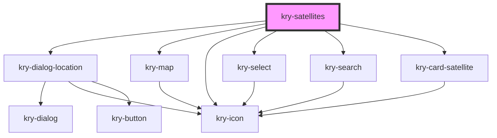

# kry-satellites

<!-- Auto Generated Below -->

## Properties

| Property        | Attribute        | Description | Type                                            | Default     |
| --------------- | ---------------- | ----------- | ----------------------------------------------- | ----------- |
| `currentFilter` | --               |             | `{ title: string; key: string; icon: string; }` | `undefined` |
| `favorites`     | --               |             | `number[]`                                      | `[]`        |
| `filter`        | --               |             | `FilterSatellites[]`                            | `[]`        |
| `language`      | `language`       |             | `"en" \| "pt-BR"`                               | `undefined` |
| `loading`       | `loading`        |             | `boolean`                                       | `undefined` |
| `loading3D`     | `loading-3-d`    |             | `boolean`                                       | `undefined` |
| `location`      | --               |             | `GeolocationPosition`                           | `undefined` |
| `pathname`      | `pathname`       |             | `string`                                        | `undefined` |
| `satellites`    | --               |             | `Satellite[]`                                   | `[]`        |
| `search`        | `search`         |             | `string`                                        | `undefined` |
| `type`          | `type`           |             | `"2D" \| "3D"`                                  | `'3D'`      |
| `view3dIcon`    | `view-3d-icon`   |             | `string`                                        | `undefined` |
| `view3dlabel`   | `view-3dlabel`   |             | `string`                                        | `undefined` |
| `viewMapIcon`   | `view-map-icon`  |             | `string`                                        | `undefined` |
| `viewMapLabel`  | `view-map-label` |             | `string`                                        | `undefined` |

## Events

| Event                  | Description | Type                                                         |
| ---------------------- | ----------- | ------------------------------------------------------------ |
| `kryChangeSearch`      |             | `CustomEvent<string>`                                        |
| `kryFallback`          |             | `CustomEvent<boolean>`                                       |
| `kryFavoriteSatellite` |             | `CustomEvent<{ id: number; favorite: boolean; }>`            |
| `kryFilter`            |             | `CustomEvent<{ title: string; key: string; icon: string; }>` |
| `kryLocation`          |             | `CustomEvent<GeolocationPosition \| boolean>`                |
| `kryRedirect`          |             | `CustomEvent<string>`                                        |
| `krySearch`            |             | `CustomEvent<boolean>`                                       |
| `kryToggleLoading3D`   |             | `CustomEvent<boolean>`                                       |
| `kryTrackSatellite`    |             | `CustomEvent<number>`                                        |

## Dependencies

### Depends on

- [kry-dialog-location](../../composites/dialog-location)
- [kry-map](../../components/map)
- [kry-icon](../../components/icon)
- [kry-select](../../components/select)
- [kry-search](../../components/search)
- [kry-card-satellite](../../components/card-satellite)

### Graph

---

_Built with [StencilJS](https://stenciljs.com/)_
