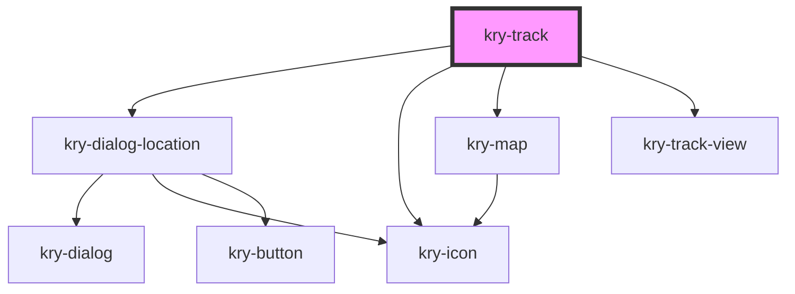

# kry-track

<!-- Auto Generated Below -->

## Properties

| Property    | Attribute  | Description | Type                                                            | Default     |
| ----------- | ---------- | ----------- | --------------------------------------------------------------- | ----------- |
| `favorite`  | `favorite` |             | `boolean`                                                       | `undefined` |
| `language`  | `language` |             | `"en" \| "pt-BR"`                                               | `undefined` |
| `loading`   | `loading`  |             | `boolean`                                                       | `undefined` |
| `satellite` | --         |             | `{ id: number; name: string; positions: SatellitePosition[]; }` | `undefined` |

## Events

| Event                  | Description | Type                                          |
| ---------------------- | ----------- | --------------------------------------------- |
| `kryFallback`          |             | `CustomEvent<boolean>`                        |
| `kryFavoriteSatellite` |             | `CustomEvent<boolean>`                        |
| `kryLocation`          |             | `CustomEvent<GeolocationPosition \| boolean>` |
| `kryRequestTrack`      |             | `CustomEvent<boolean>`                        |
| `kryTrackSatellite`    |             | `CustomEvent<boolean>`                        |

## Dependencies

### Depends on

- [kry-dialog-location](../../composites/dialog-location)
- [kry-icon](../../components/icon)
- [kry-map](../../components/map)
- [kry-track-view](../../components/track-view)

### Graph

---

_Built with [StencilJS](https://stenciljs.com/)_
