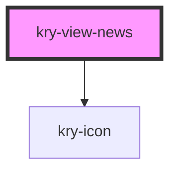

# kry-view-news

<!-- Auto Generated Below -->

## Properties

| Property | Attribute | Description | Type                                                                                                                                                                 | Default     |
| -------- | --------- | ----------- | -------------------------------------------------------------------------------------------------------------------------------------------------------------------- | ----------- |
| `news`   | --        |             | `{ _id: string; title: string; description: string; content: string; cover: string; created_at: string; origin: string; deleted_at?: string; updated_at?: string; }` | `undefined` |

## Events

| Event         | Description | Type                   |
| ------------- | ----------- | ---------------------- |
| `kryFallback` |             | `CustomEvent<boolean>` |

## Dependencies

### Depends on

- [kry-icon](../../components/icon)

### Graph

---

_Built with [StencilJS](https://stenciljs.com/)_
